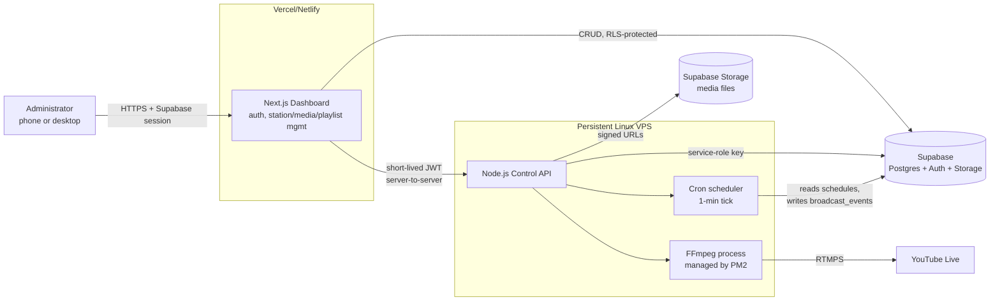

# Architecture



**Key boundary:** the browser only ever talks to the Next.js dashboard. The
dashboard's server-side route handlers are the only thing that can reach the
worker, and the worker is the only thing that can reach FFmpeg / the RTMPS
stream key. No stream key or service-role credential is ever sent to a
browser.

**Ownership hierarchy reflected in the code:**

```
Hope Creative LLC (or your tech company)
  owns
    HopeCast Radio Platform  (this codebase — generic, station-agnostic)
      powers
        Delana Hope Weekend Radio  (a `stations` row, not a hardcoded name)
          broadcasts through
            Delana Hope YouTube channel  (a `stream_destinations` row)
```

Each layer only knows about the layer directly below it through a database
foreign key, never a hardcoded name — so a second station/artist/channel
plugs into the same platform without any code change.

**Multi-station-from-day-one, single-broadcast MVP:** every table is already
partitioned by `station_id`. The one exception — deliberately — is a single-row
`broadcast_lock` table that any station's worker must atomically claim before
going live and release when it stops. That's the entire mechanism enforcing
"only one station live at a time"; removing that one constraint later is the
whole migration path to concurrent multi-station broadcasting.
